# **Interface Templates for 3. Sign Up Page**
| Element Type | Logic, description, fill | Image | Method |
|--------------|--------------------------|-------|--------|
| The Registration Form includes the fields: 1) Name 2) Surname 3) City 4) District 5) Postal code 6) Email 7) Password 8) Repeat password (all TextBox types) (FR1) | On the Registration page, the User enters their Name, Surname, City, Region, Postal code, Email, Password and Repeat password in the fields. When information is entered in all fields, the Register button is highlighted. | 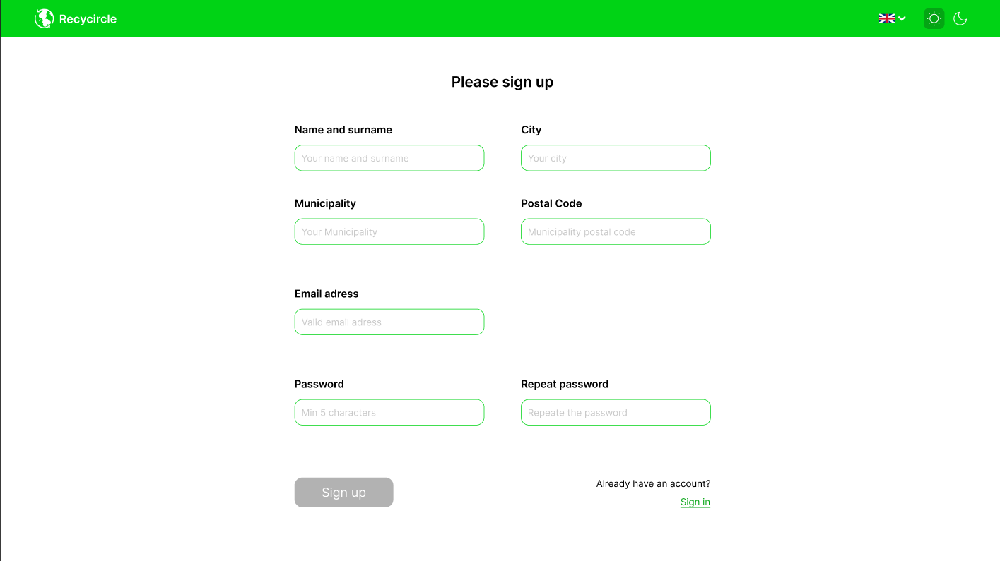 | GET /SignUpPage |
| Password Field – Password Hint (message type) (FR3) | When the User starts to enter the password, a Hint appears stating that the Secure Password must contain at least 8 characters containing letters and numbers. | 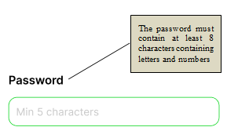 | GET /PasswordField |
| Password Field – Progress Bar. (FR3) | When the User enters a password, a progress bar appears in the center below, which looks like an increasing bar as the password is entered and turns green when the password meets the minimum security requirements (at least 8 characters, including letters and numbers) and a message appears stating that the password meets the security requirements. | 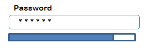 | GET /PasswordProgressBar |
| Invisible Password Mode (FR3) | When the User enters a password in the appropriate field, the password symbols are replaced by large black dots. | 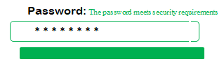 | POST /InvisiblePasswordMode |
|Visible Password Mode Button (FR14) | The user can, if desired, press the Visible Password Mode button, and the characters in the Password and Repeat Password fields will become visible and will no longer be replaced by dots. When this button is pressed again, the password characters in the corresponding fields will again be replaced by dots. The Button is located to the right of the Repeat Password field. |  | POST /VisiblePasswordMode |
| Password Repeat Field – Password Match Message (Message Type) (FR14) | When re-entering a password in the Repeat Password field, the user sees a message about the password mismatch, and when the passwords match, receives a message about the password match. It appears as a Hint. | 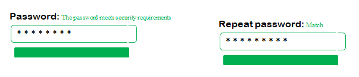 | GET /RepeatPassword |
| Registration Button (Push Type) (FR5) | When all fields of the Registration form are filled in, the Registration button is activated. When the activated Registration button is clicked, the User sees a message on the screen that a confirmation link has been sent to the Email, as well as a message that if the User has not received this letter, he can repeat the registration procedure or contact the Support Service. The User's data (Name, Last Name, Geography, Email, Password) are saved in the Preliminary Registration Log of the Application. It is located at the bottom of the form in the center. | 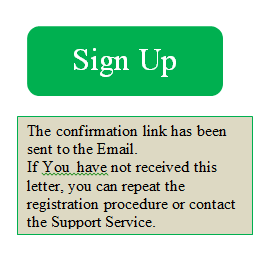 | POST /RegistrationButton |
| Confirmation Link (FR6) | A confirmation link is sent to the email specified by the User. When clicking on this link, the User is directed to the Application Main Page, where he/she sees a message about successful registration. The registration data specified by the User is saved in the Application Database. | 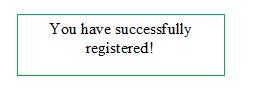 | GET /SuccessfulConfirmationLink |
| Auto-filling of the District field (FR4) | When the User starts typing the name of a District, District options are suggested by the first letters, which can be filled in automatically. This is done as a hint linked to the District Database. |  | GET /AutoFilling |
| Email Confirmation Button (Link Type) (FR2) | When the User has entered their email address, they have the option to click on a link to confirm their email. It is located as underlined text below the Email address field. When this button is clicked, a confirmation link is sent to the User's specified email. | 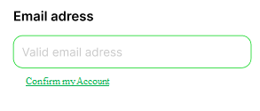 | GET /EmailConfirmation |
| Captcha form (FR10) | Below the Registration button is a Captcha form button, which is presented as underlined text "Confirm that you are not a robot". After the User clicks this button, a Captcha form appears, in which the User is asked to enter the symbols shown on the screen. If the test is successfully passed, a message is displayed that "Test passed successfully!" and the Registration button is activated. | 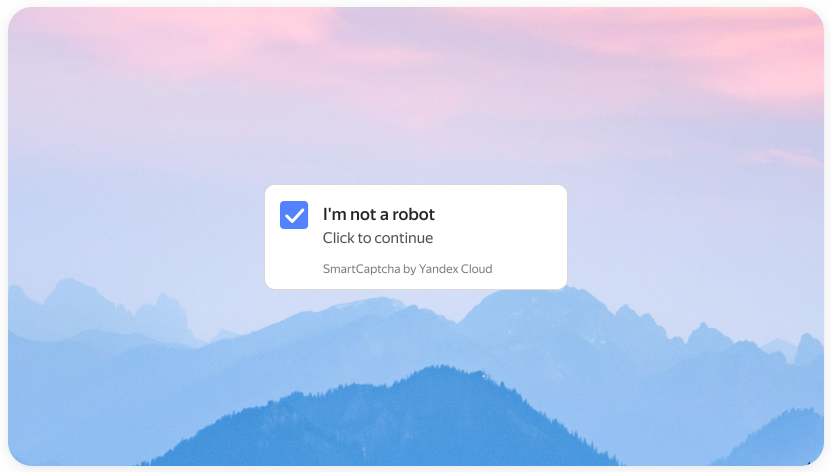 | GET /CaptchaForm |
| Pre-shipment check - message (FR15) | After successfully passing the Captcha check, a message appears saying "Please check that all fields are filled in correctly and that the Terms and Conditions and Privacy Policy are confirmed." | 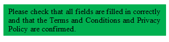 | GET /CheckBeforeSending |
| Link to Terms and Conditions and Privacy Policy. (FR7) | By clicking this button, the User is redirected to the Terms and Conditions and Privacy Policy page. It is presented as underlined text above the Registration button. | 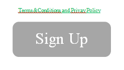 | GET /LinkToTermsAndConditions |
| Progress indicator (FR19) | At the bottom center of the page is a progress indicator that shows the progress of the registration process after each successful step. | 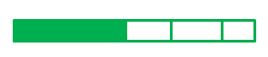 | GET /ProgressIndicator |
