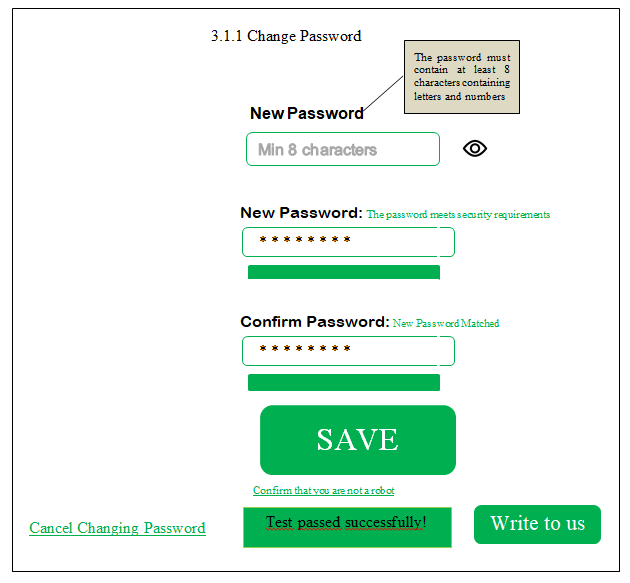
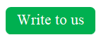

# **Interface Templates for 3.1.1. Change Password Page**
| Element Type | Logic, description, fill | Image | Method |
|--------------|--------------------------|-------|--------|
| The Change Password form includes the fields: 1) Old password 2) New password 3) Confirm new password (All TextBox types) FR1 | On the Change Password page, the User enters their old password (8 to 20 characters), new password (8 to 20 characters), and repeats the new password (8 to 20 characters) into the fields. When all fields have been entered, the Save button is highlighted. |  | GET /ChangePasswordForm |
| Save Button (Push Type) FR5 | When the User fills in the fields of the Change Password form, the Save button is activated. When this button is clicked, the Old Password entered in the field is compared with the details saved in the database (FR2). If the passwords match, a confirmation link is sent to the User's email (FR8) and a message about this event is issued. When the User clicks on the link sent to the email, he is redirected to the Login page for new authentication (FR9). All Application sessions opened up to this point are closed (FR15, FR18). A message about a successful password change is issued. The fact of an attempt to change the password is saved in the corresponding Application log (FR7). If the old passwords do not match, a message about an incorrect password is issued (FR10). |  | GET /SaveButton |
| New Password Field – Password Hint (message type) FR3 | When the User starts to enter the password, a Hint appears stating that the Secure Password must contain at least 8 characters containing letters and numbers (FR16). |  | GET /NewPasswordFiled |
| FR4 Password Confirmation Field | To avoid typos, the User re-enters the new password in this field. When entering the password confirmation, until the password matches, a message about the password mismatch is displayed (FR10). |  | GET /ConfirmationPasswordMessage |
| Captcha form FRR11 | Below the Save button is the Captcha form button, which is presented as underlined text "Confirm that you are not a robot". After the User clicks this button, the Captcha form appears, in which the User is asked to enter the symbols shown on the screen. If the test is successfully passed, a message is displayed that "Test passed successfully!" and the Save button is activated. |  | GET /CaptchaForm |
| Link to cancel the FR12 password change process (link type) | The user, at any time before pressing the Save button, can press this link, after which he will be redirected to the User Profile page. It is located in the lower left corner. |  | POST /CancelChangingPassword |
| Invisible Password Mode FR14 | When the User enters a password in the appropriate field, the password symbols are replaced by large black dots. |  | POST /InvisiblePasswordMode |
| Visible Password Mode Button (Toggle Type) FR14 | The user can, if desired, press the Visible Password Mode button, and the characters in the Password field will become visible and will no longer be replaced by dots. When this button is pressed again, the password characters in the corresponding field will again be replaced by dots. The Button is located to the right of the Password field. FR14 |  | POST /InvisiblePasswordMode |
| Password Field – Progress Bar. FR19 | When the User enters a password, a progress bar appears in the center below, which looks like an increasing bar as the password is entered and turns green when the password meets the minimum security requirements (at least 8 characters, including letters and numbers) and a message appears stating that the password meets the security requirements. |  | GET /PasswordProgressIndicator |
| Contact Us Support Button (Push Type) FR20 | In case of any difficulties, the User can click on this button and open the contact form with the manager, where he/she can describe his/her problem. This button is located in the lower right corner. |  | GET /WriteToUsButton |
