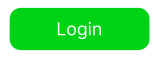

# **Interface Templates for 3.1. Log In Page**
| Element Type | Logic, description, fill | Image | Method |
|--------------|--------------------------|-------|--------|
| The Authorization Form includes the fields: 1) Email or First and Last Name (1 to 20 characters) 2) Password (8 to 20 characters) (All TextBox types) FR1 | On the Authorization page, the User enters their Name, Surname, and Password in the fields. When all fields have been entered, the Register button is highlighted. |  | GET /SignInForm |
| Login Button (Push Type) Log In FR3 | When the User fills in the Authorization form fields, the Login button is activated. When this button is clicked, the data entered in the fields (Name and Surname, email, password) is compared with the data saved in the database (FR2). If the data is successfully authorized, the User is redirected to the Main Menu page. If the data is not authorized, a message is issued about the inappropriate Name, email or password. |  | GET /IncorrectLogInAttemptMessage |
| Login Error Message (Type Message) FR9 | If incorrect data is entered during the authorization process, the message “Incorrect Login Attempt” is displayed. The number of login attempts is counted. If the number of attempts exceeds 5, the authorization process is terminated for 30 minutes, about which the message “The number of authorization attempts has exceeded the permissible limit. Try again in 30 minutes!” is displayed FR10 |  | GET /AttemptsOutMessage |
| Option "Change password" (type link) | The user has the ability to change the password and personal data (FR20). The "Change password" button is located to the right of the "Password" field in the form of an underlined text link. When the "Change password" button is pressed, a form for changing the password and personal data opens. The form for changing the password and personal data opens if the correct data, including the password, is entered during the authorization process. FR5 |  | GET /ChangePasswordLink |
| Invisible password mode | When the User enters a password in the appropriate field, the password symbols are replaced by large black dots. |  | POST /InvisiblePasswordMode |
| Visible Password Mode Button (Toggle Type) | The user can, if desired, press the Visible Password Mode button, and the characters in the Password field will become visible and will no longer be replaced by dots. When this button is pressed again, the password characters in the corresponding field will again be replaced by dots. The Button is located to the right of the Password field. FR8 |  | POST /VisiblePasswordMode |
| Multi-factor authentication (link type) Field Enter additional code | After pressing the Login button, a message is displayed stating that a code has been sent to the email address, which must be entered in the appropriate field. If the User enters the correct code, the User is redirected to the Main Menu page. FR11. If the code is entered incorrectly, the message "Incorrect code entered, Try again. The corresponding Application log stores information about the number of attempts, and if the number of unsuccessful attempts exceeds 5, a corresponding message is displayed and the system stops the Authorization process for 30 minutes, about which the User is given a corresponding message. |  | GET /ACodeSentMessage |
| Forgot your password? button (link type) FR13 | If the User has forgotten the password, he/she can click this button. The button is located at the bottom of the Password field in the form of an underlined text link. If this button is clicked, a link to restore the password is sent to the email and the User receives the message "A link to restore the Password has been sent to your email". After the User clicks the corresponding link in the email, the User is redirected to the Password change form. |  | GET /ForgetPasswordMessage |
| Password Field – Password Hint (message type) FR15 | When the User starts to enter the password, a Hint appears stating that the Secure Password must contain at least 8 characters containing letters and numbers. |  | GET /PasswordHint |
| Password Field – Progress Bar. FR15 | When the User enters a password, a progress bar appears in the center below, which looks like an increasing bar as the password is entered and turns green when the password meets the minimum security requirements (at least 8 characters, including letters and numbers) and a message appears stating that the password meets the security requirements. |  | GET /PasswordProgressBar |
| Contact Us Support Button (Push Type) FR18 | In case of any difficulties, the User can click on this button and open the contact form with the manager, where he/she can describe his/her problem. This button is located in the lower right corner. |  | GET /CustomerSupportButton |
| Toggle Button for Visually Impaired Users FR19 | A visually impaired user presses this button and the slides and text of the Site become larger in size, contrasting, and also with the possibility of voice accompaniment, for the convenience of this category of users. It is located at the top of the page in the center. |  | POST /VisualImparmentUserToggle |
| Google Account Authentication Button | The user has the opportunity to go through the authentication process through their own Google account. By clicking this button, a link to the authentication process integrated into our Application through a Google account opens. It is located below the Password field in the middle. |  | GET /GoogleAuthentification |
| Facebook Account Authentication Button | The user has the opportunity to go through the authentication process through his own Facebook account. By clicking this button, a link to the authentication process integrated into our Application through a Facebook account opens. It is located below the Password field in the middle. |  | GET /FacebookAuthentification |
| Authentication button via X Account | The user has the opportunity to go through the authentication process through his own X account. By clicking this button, a link to the authentication process integrated into our Application through the X account opens. It is located below the Password field in the middle. |  | GET /XAuthentification |
