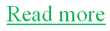
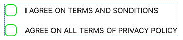
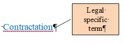
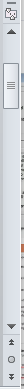
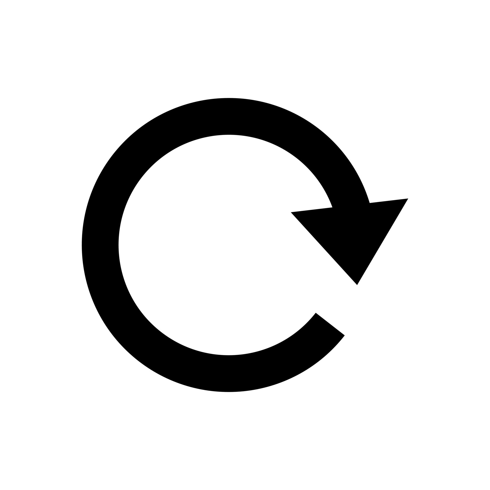
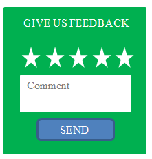
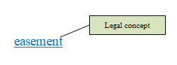
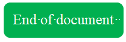

# **Interface Templates for 2. General Terms And Conditions Page**
| Element Type | Logic, description, fill | Image | Method |
|--------------|--------------------------|-------|--------|
| Кнопка Читать больше (тип ссылка) (FR2) | On the General Terms and Conditions page, after the text of the Terms and Conditions section, there is a Read more link. By clicking this button, the User opens the full Terms and Conditions document. There is also a similar button after the text of the Privacy Policy section. When the User clicks this button, the full Privacy Policy document opens, which the User can read. | | GET /ReadMoreLink |
| Download Button (FR11) | When opening the full Terms and Conditions document and the full Privacy Policy document, the User can click the Download button, which opens a form to save the document file, and the User has the option to save the document file to a location of their choice. It is located in the lower right corner. |  | GET /DownLoad |
| Back button (FR5) | When opening the full Terms and Conditions document and the full Privacy Policy document, the User can click the Back button, which returns the User to the General Terms and Conditions page. |  | GET /BackButton |
| Two buttons to confirm consent (CheckBox Type)(FR3) | On the General Terms and Conditions page, after the text of all sections, there are two buttons. In case of agreement with the Terms and Conditions, as well as the Privacy Policy, the User checks the two buttons. The two buttons are linked to the Continue button - when the User checks them, the Continue button becomes active. |  | POST /AgreeCheckBoxes |
| Proceed button (Push type)(FR4) | On the General Terms and Conditions page, after all the text, there is a Continue button at the bottom in the middle. The Continue button becomes active when the User checks the two previous buttons. When the User clicks on the activated Continue button, the Site redirects the User to the Registration page. Also, after clicking the Continue button, the User's consent to the Terms and Conditions, as well as the Privacy Policy, is saved in the corresponding log. |  | POST /ProceedButton |
| Tooltips and Links (FR19) | In the full text of the Terms and Conditions and Privacy Policy, there are Pop-up hints and links throughout the text. As the user reads the text, they have the opportunity to clarify terms and get answers to frequently asked questions. |  | GET /ToolTipsLink |
| Scrolling mechanism (FR19) | The user moves the contents of the document up or down using a scrolling mechanism. It is located on the side. |  | POST /ScrollMechanism |
| Refresh button (FR6) | In case of an error loading of the page, a refresh button appears. The user clicks on this button and the page loading resumes. It is located at the top right. |  | GET /RefreshButton |
| Search button (FR17) | By pressing this button, the user enables the search function, within which he can enter any set of characters and the function will search the document of this set. It is located in the upper right corner. |  | GET /SearchFunction |
| Feedback form (FR17) | On the General Terms and Policies page, the User can leave a comment or ask a question by selecting the feedback form, which is located in the lower right corner. |  | GET /FeedBackForm |
| Hints (link type) (FR14) | When reading the full Terms and Conditions and Privacy Policy, the User, upon encountering a professional or specific term, has the option of hovering over it and, by clicking, opening the definition of the term, which is linked to a dictionary of specific terms. |  | GET /HintsLink |
| Message End of Document (FR19) | When the User reaches the end of the document, a message about the end of the document appears at the bottom of the page. |  | GET /EndOfDocumentMessage |
