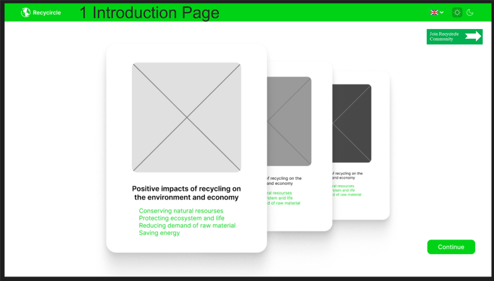

# **Interface Templates for 1. Introduction Page**
| Element Type | Logic, description, fill | Image | Method |
|--------------|--------------------------|-------|--------|
|Swipe Action Element | Switches from the first slide to the second. An unregistered user is on the very first page of the Application, where he sees the first slide. By swiping the screen, an unregistered user switches to the second slide of the first page. Dynamic execution. | ![Introduction Page Form] (1 IntroductionPageTemplateForm.jpg) | GET /SwipeElement |

