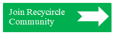
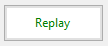
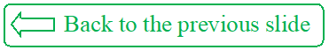
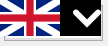
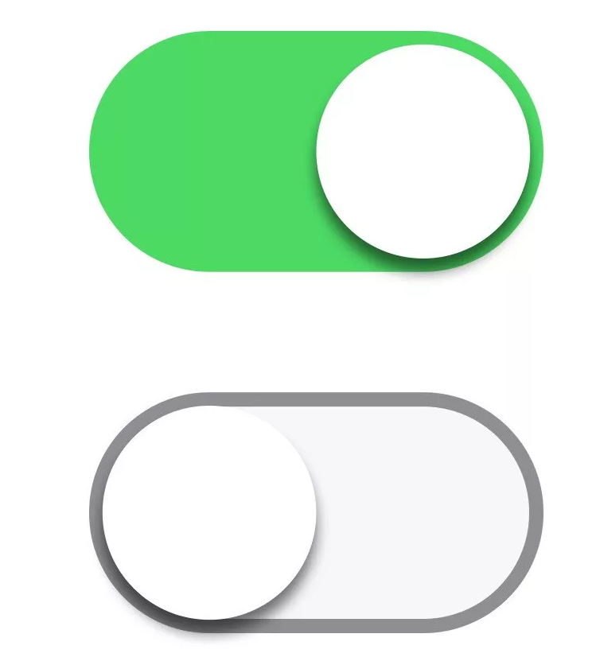
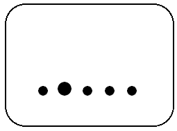
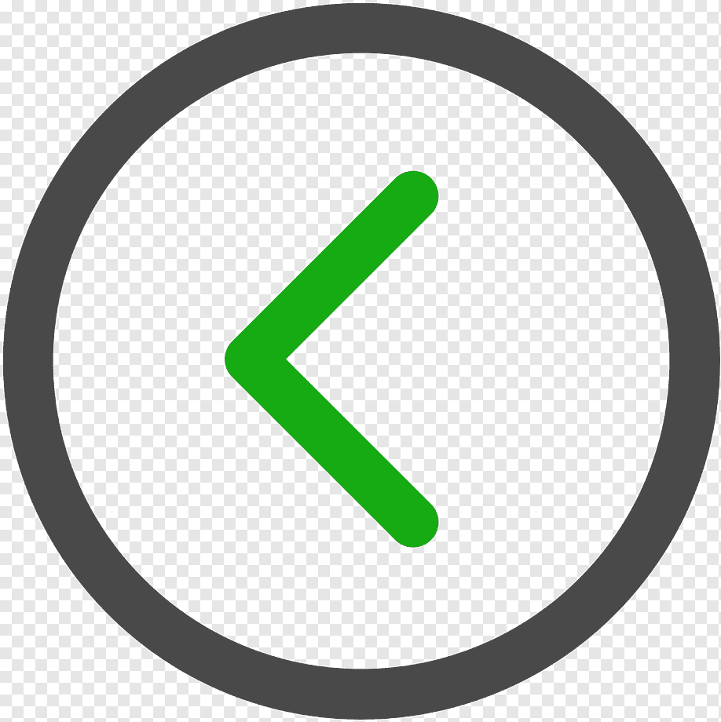
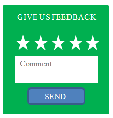

# **Interface Templates for 1. Introduction Page**
| Element Type | Logic, description, fill | Image | Method |
|--------------|--------------------------|-------|--------|
|Swipe Action Element | Switches from the first slide to the second. An unregistered user is on the very first page of the Application, where he sees the first slide. By swiping the screen, an unregistered user switches to the second slide of the first page. Dynamic execution. |  | GET /SwipeElement |
| Continue button (Push type) | Duplicates the logic and actions of Swipe Action. Located in the lower right corner. |  | GET /ContinueButton |
| Join Recicycle Community Button (Push Type) | On the second slide of the first page, the Unregistered User sees and has the option to click the Join Recicycle Community button. When clicked, the User is redirected to the Registration page. It is located in the upper right corner. |  | GET /JoinRecycircleCommunity |
| Replay button (Push type) | On the second slide of the introductory page, the User has the option to repeat viewing the slide by clicking the Replay button. It is located in the lower right corner. |  |   GET /ReplayButton |
| Back to previous slide button | On the second slide of the Introductory Page there is a button that allows the User to return to viewing the previous slide. It is located in the lower left corner. |  | GET /BackToPreviousSlide |
| Support multiple languages ​​button | The Introduction page has a User language selection button, which allows you to select the language into which all site content will be translated. It is located at the top of the Support bar. |   | GET /SupportLanguage |
| Toggle button for visually impaired users | There is a button on the Introductory page for users with visual impairments. A user with visual impairments presses this button and the slides and text of the Site become larger in size for the convenience of this category of users. It is located at the top of the page in the center. |  | GET /VisualImpairedToggle |
| User Navigation Hints: 1) Arrow in a circle (Push type) 2) Progress bar Dots (Push type) 3) Contact manager (Push type) | 1) Two Arrow buttons. When the User clicks the button, the user goes to the next slide or page of the site. They are located on the right and left in the middle. 2) A progress bar in the form of dots. A highlighted dot shows what step the User is on. When you click on an inactive dot, you go to the page it is associated with. They are located at the bottom in the middle. 3) Write to us button. When you click on this button, the Feedback form opens. It is located in the lower right corner. |     | GET /ProgressScale POST /RightArrow POST /LeftArrow POST /WriteToUs |
| Skip button | A user familiar with the contents of the introductory page can click this button and skip the Introductory Page. |   | GET /SkipButton |
| Button to turn on the sound accompaniment of the content | On the first and second slides of the Introductory page there is a button for audio accompaniment of the content, by clicking on which the User can listen to the information contained on the slide. It is located immediately below the slide. |  | GET /ListenButton |
| Rating and Feedback Form | The first and second slides of the Introductory Page contain the Rating and Feedback Form. The user selects the number of stars that the system saves as a rating, and also has the opportunity to write their comment in the form, which is saved by the system for further analysis. The form is located in the lower right corner. |  | GET /FeedBackForm |
